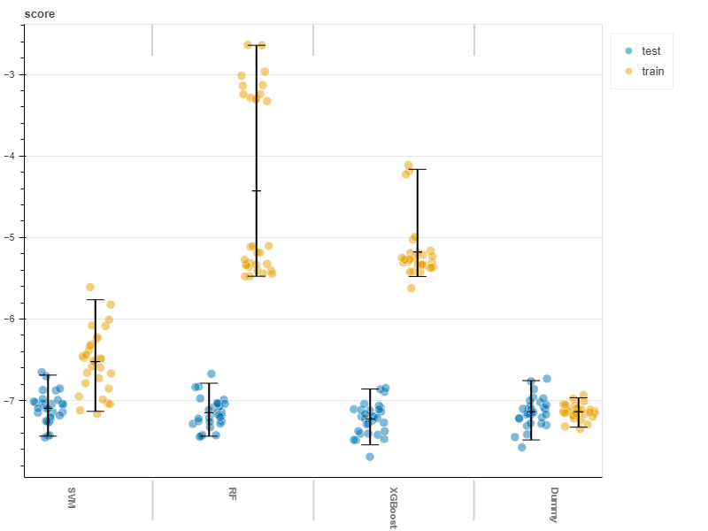
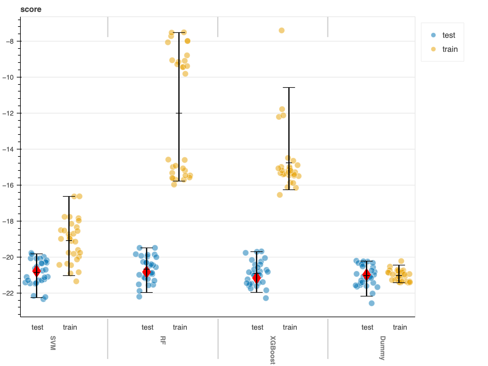

# Post-analysis
--------------

## Resultados

### Parcelación con Schaefer
En primer lugar, utilizamos la parcelación Schaefer de 400 parcelaciones y 7 networks por ser el mismo que se utiliza en el paper. Entrenamos los modelos SVM, Random Forest, XGBoost y un modelo Dummy para comparar las predicciones. Estos modelos fueron usados para predecir 3 targets diferentes, por lo que presentaremos los resultados por cada target. Recordemos que el entrenamiento para train y test fueron calculados sobre el 90% de los datos totales del dataset original, ya que nos guardamos un 10% restante para la validación. Se pueden ver 30 scores diferentes que representan el score de cada fold (10 repeticiones de 3 folds). En cada iteración se utilizan 2 para train y uno para test.

**IST Crystallized Intelligence:**
A continuación, se muestra el score plot de los cuatro modelos sobre la predicción de la Crystallized Intelligence. 

Como podemos observar, no parece haber una mejora significativa de ningun modelo con respecto al modelo Dummy. Los modelos Random Forest y XGBoost parecen haberse ajustado demasiado a los datos de entrenamiento causando overfitting. Sin embargo, el SVM consigue el mejor score promedio de los cuatro. 

Por otro lado, también es importante fijarse si sus predicciones son confiables. Para esto, usamos cada modelo para predecir con valores nuevos:

Este gráfico muestra el mismo plot score pero con el score de holdout set, que representan el 10% restante del dataset original. Se puede notar ahora que los modelos entrenados consiguieron valores muy parecidos a la media de sus anteriores predicciones en test, mientras que Dummy empeoró sus resultados con mucha diferencia de su media. Una vez más, el mejor score lo tuvo el SVM.

**IST Fluid Intelligence:**
El próximo gráfico muestra el score plot para Fluid Intelligence de cada modelo utilizado. 

En este caso, tenemos el mismo problema que en el target anterior. No hay una mejora significativa con respecto al modelo Dummy, y tanto Random Forest como XGBoost están overfitteando. Una diferencia notable es que los scores conseguidos son mucho peores en comparación con la predicción del target anterior. Mientras que el score promedio conseguido en la predicciones al anterior target eran -8, acá son -21. 

Veamos cómo performan los modelos ante nuevos datos:

Esto es consistente con lo que vimos en las predicciones sobre el target anterior. Los modelos entrenados presentan una mejor reliability que el modelo Dummy, por lo que si bien el Dummy pareciera tener buenos resultados, es mejor confiar en las predicciones de los modelos y ensambles entrenados. 

**IST Memory Intelligence:**
Por último, tenemos el score plot sobre la Memory Intelligence.

Los resultados obtenidos siguen siendo muy parecidos a los dos anteriores. 

En los tres gráficos podemos observar como ninguno de los modelos es particularmente destacable, sino que los modelos SVM, Random Forest y XGBoost tienen un comportamiento similar a un modelo Dummy. Esto nos indica a priori que ningun modelo de los utilizados presenta una mejor aproximación a simplemente predecir la media. 

Veamos qué pasa al predecir valores nuevos:

A diferencia de los resultados anteriores, el Dummy esta vez presenta el mejor score sobre el holdout set. Esto puede deberse a que la varianza es chica, por lo que los valores no se separan mucho de la media. Por otro lado, este target presenta los mejores scores promedio en comparación con los anteriores.

**Correlación y regresión de cada modelo:**
En los siguientes gráficos podemos observar la relación entre el IST Intelligence Total calculado en base a la suma de las tres catgorías predichas anteriormente, y el valor de inteligencia real. Las predicciones se calcularon sobre el set de validación y para cada uno de los tres modelos entrenados. 

Como vemos en los gráficos anteriores, al intentar predecir la inteligencia con valores de las tres categorías predichas, las cuales tenian cierto grado de error, no termina habiendo una buena correlación con el valor real esperado. Es decir, los errores en las predicciones individuales de cada categoria se ven aumentados por la suma para predecir la inteligencia total. Por otro lado, podemos ver que el modelo SVM presenta levemente mejor correlación en comparación con los demás modelos, lo cual tiene sentido siendo que fue el que mejor scores obtuvo en cada categoría con respecto al set de validación.

### Parcelación con Shen
Por otro lado, probamos con la parcelación Shen con 368 parcelaciones con los mismos modelos y repetimos nuevamente el análisis, replicando los mismos gráficos.

Comenzamos viendo el score plot para **Crystallized Intelligence**.

Ahora veamos el score plot para la **Fluid Intelligence** correspondiente a cada modelo.

Y finalmente, vemos el score plot para la **Memory Intelligence**.

Nuevamente podemos observar como, al igual que pasaba con la parcelación Schaefer, los modelos no mejoran significativamente los scores de un modelo Dummy. Además, se vuelve a observar un sobreajuste en los ensambles elegidos: Random Forest y XGBoost. Los scores también presentan valores promedio percidos a los conseguidos con Schaefer.

Veamos si sucede lo mismo con los valores del set de validación:

Primero mostramos los resultados para **Crystallized Intelligence**.

Luego, para **Fluid Intelligence**.

Y por último, para **Memory Intelligence**.

En este caso, los scores calculados sobre el validation set mejoraron con los primeros dos targets a comparación con los obtenidos usando la parcelación Schaefer, pero empeoraron para la memory intelligence. Esta vez, los scores se alejaron más de la media en el último gráfico pero manteniendo los valores relativos entre modelos.

**Correlación y regresión de cada modelo:**
Finalmente, realizamos nuevamente la suma de las predicciones de las tres categorías predichas anteriormente y lo comparamos con el valor real de inteligencia total para el set de validación.

Dados estos nuevos gráficos, podemos ver que nuevamente no obtuvimos un modelo significativamente bueno para predecir el valor real de inteligencia. Sin embargo, podemos destacar al modelo SVM por presentar una mejor correlación con los valores esperados. En resumen, no notamos diferencias significativas en comparación a la parcelación de Schaefer.

## Conclusión

Los resultados observados nos indican que, en un principio, los modelos seleccionados no permiten mejorar las estimaciones de un modelo Dummy que toma simplemente la media y predice con la misma. Sin embargo, luego de generar estimaciones con valores nuevos, pudimos observar que los modelos entrenados conseguían scores más consistentes con los que se habían calculado con los test sets. Esto nos permite tener una mayor seguridad y confianza sobre la performance de nuestros modelos por sobre el modelo Dummy. Esto es parcialmente cierto porque solo funcionó en el caso de los targets Crystallized y Fluid Intelligence, mientras que con Memory Intelligence el Dummy seguía dando los mejores resultados incluso con datos nuevos. Esto último puede haber ocirrido por el hecho de que la Memory Intelligence sigue una distribución normal bien marcada con una desviación estandar más chica que las otras categorías, por lo que predecir la media era una buena opción la mayoría de las veces. 

Además, habíamos notado que los modelos de ensamble se sobreajustaban a los datos de entrenamiento ya que el score daba mucho mejor en train que en test, mientras que SVM regularizaba mejor consiguiendo resultados más consistentes entre sets. Esto se debe a que probamos muchos más valores para SVM utilizando BayesSearch mientras que para RandomForest y XGBoost hicimos un GridSearch con pocos valores.

Por otro lado, no observamos una gran mejora de los scores utilizando una parcelación diferente. Ambas parcelaciones tuvieron una performance muy similar obteniendo scores promedio muy parecidos entre targets. Ambas parcelaciones elegidas tienen una cantidad total de features parecida (400 y 368), por lo que, a pesar de que las parcelaciones sean distintas, al tener casi la misma dimensionalidad no se pudo observar un cambio significativo.

Por último, la inteligencia total calculada a partir de la suma de las predicciones de las otras categorías no resultó teniendo buenos resultados. A pesar que la inteligencia total esta fuertemente correlacionada con las otras categorias por ser una transformación lineal de los targets, al intentar conseguir predecir el total de esta manera terminamos sumando los errores. Esto termina afectando el resultado, por lo que una mejor aproximación hubiera sido ajustar los modelos directamente a los valores de la inteligencia total.
